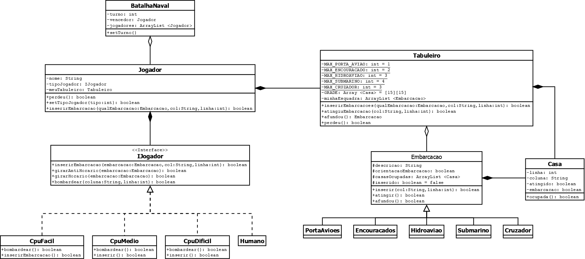

# Batalha Naval - POO

Atividade como requisito avaliativo para a disciplina **Programação Orientada a Objetos**, ministrada pelo Programa de Graduação em Sistemas de Informação, PUC Minas - Unidade São Gabriel.

## Diagrama de Classes - UML

## Integrantes

* Daniel Trindade Nunes
* Gabriel de Oliveira Fávero
* Frederico Henrique Pires da Silva
* João Dias
* Rafael Santos Nunes Vieira

